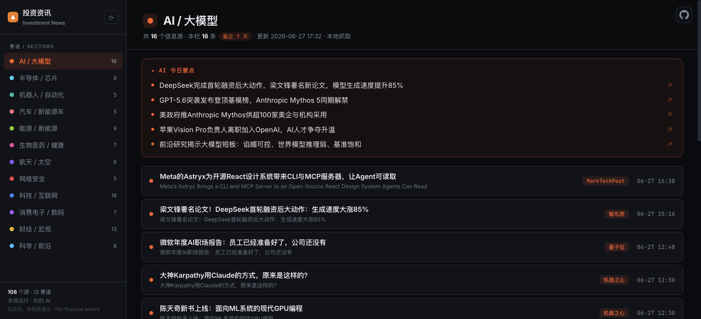

# Investment News · 投资资讯

**你投的每个赛道,AI 每天替你嚼成几条要点 —— 100% 本地运行,用你自己的 AI,零 API key。**

*Your investment sectors, distilled into a daily brief by your own AI. Runs 100% local, zero API key.*

一个本地运行的「投资赛道资讯看板」:从全球 100+ 个权威信息源抓取 12 大赛道(AI/大模型 · 半导体/芯片 · 机器人/自动化 · 汽车/新能源车 · 能源/新能源 · 生物医药/健康 · 航天/太空 · 网络安全 · 科技/互联网 · 消费电子/数码 · 财经/宏观 · 科学/前沿)的最新动向,用**你自己的大模型**(Claude 订阅 或 任意 API)提炼成每个赛道的「今日要点」并翻译成中文。一眼看尽,感兴趣再点原文。

> ⚠️ **仅为资讯聚合工具,不构成任何投资建议。** This is a news tool, **not financial advice**.

---

## 它解决什么

> 想盯住一堆赛道,但新闻太多、人读不过来,而且大半是英文。

- **AI 替你读完、提炼**：每个赛道顶部 3–5 条「今日要点」,跨多源聚合去重,人扫一眼就掌握全局。
- **全中文**：英文标题自动翻译,英语不好也能刷。
- **本地 + 零 key**：抓取在你机器上跑(纯 Python 标准库),AI 用你**自己**的 Claude 订阅($0)或 API key——数据不出本机,不依赖任何托管服务。
- **要点可溯源**：每条要点带 ↗ 直达原文。
- **合规过滤**：自动滤掉赌博 / 预测市场 / 加密 / 色情类内容。

## 截图



> **本工具的本体就是这个浏览器看板。** 跑起来后,一切操作的终点都是打开 `http://localhost:8793` 看它 —— AI 今日要点、中文翻译、分赛道、跳转原文,全在这个网页里(终端给不了)。

## 快速开始

**依赖**：Python 3（标准库即可,无需 pip 装任何东西）+ 一个大模型(下面二选一)。

```bash
# 1) 配置大模型(见下方「配置」)——默认用本机 Claude 订阅,零成本
# 2) 启动看板
python3 server.py            # 默认端口 8793
# 3) 浏览器打开
open http://localhost:8793   # 或手动访问
# 4) 点左上角 ⟳ 刷新 —— AI 去抓取 + 出要点 + 翻译,转圈跑完自动更新
```

## 配置大模型（订阅 / API 二选一）

编辑 `llm.config.json`：

| provider | 说明 | 成本 |
|---|---|---|
| `claude-cli`（默认） | 用本机已登录的 **Claude Code 订阅**(`claude login` 过一次即可) | **$0** |
| `api` | 任意 **OpenAI 兼容 API**(DeepSeek / OpenAI / 硅基流动 / OpenRouter…) | 按量 |

```jsonc
{ "provider": "claude-cli" }          // 用订阅,啥都不用填
// 或
{ "provider": "api",
  "api": { "base_url": "https://api.deepseek.com", "api_key": "sk-...", "model": "deepseek-chat" } }
```

## 自定义信息源

`sources.json` 里是 108 个精选源,按赛道(`hint`)分组。加源只要加一行：

```jsonc
{ "name": "某媒体", "hint": "ai", "type": "rss", "url": "https://example.com/feed" }
```

`recent_days` 控制只看最近几天(默认 7)。

## 工作原理

```
sources.json (源清单)
   → scripts/fetch.py    抓取 + 红线过滤 + 最近N天 + 北京时间        → data.js
   → scripts/digest.py   你的 AI 出「今日要点」+ 中文翻译 + 溯源链接  → data.js
   → index.html          读 data.js 渲染看板(无构建、单文件、零依赖)
   server.py             本地服务 + 刷新按钮的 /api/refresh 接口
```

全程纯 Python 标准库 + 一个大模型,无数据库、无 RSSHub、无托管服务。

## License

MIT
